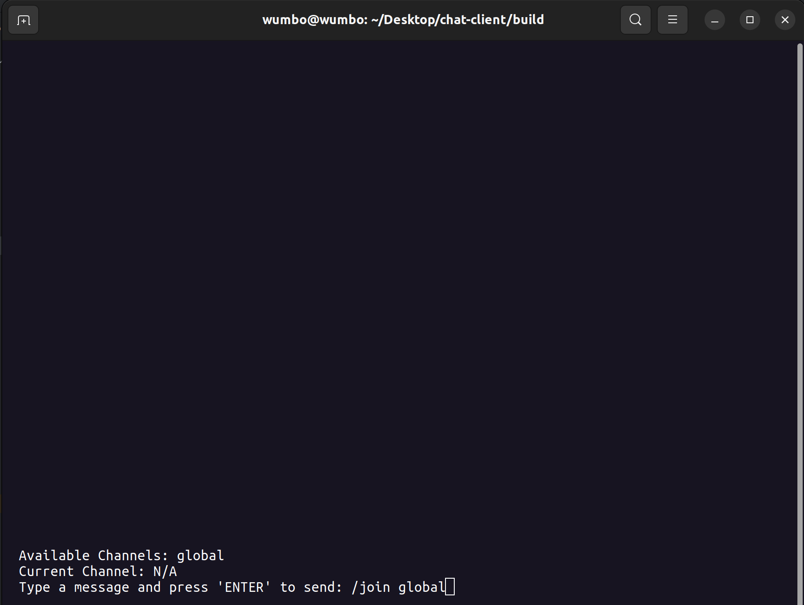

# chat-client

## Background
chat-client is a 19-person term project for the data communications option where we were split into three 
server teams and three client teams that then had to make and implement our own Chat Communication RFC. 
My team was tasked to create a simple client program that supports but not limited to:
- Creating a user or channel
- Reading a channel for messages
- Updating a user or channel
- Deleting a user auth

## Documentation
Documentation for the client and UI can be found in the [google docs](https://drive.google.com/drive/folders/1sTSOmyL2luSoZsowF4WVsO1htpUBOTD7?usp=sharing) folder.

## Example Video
The following is a video of our client interacting with one of the three server teams.
    

## Example Images

### Signup

### Login

### Join Channel

### Message

### Leave Channel

### Logout
